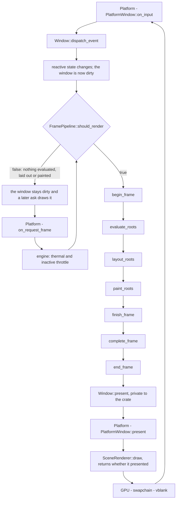

# The frame, and where the seams are

One frame, from the platform asking for it to pixels on the glass, and the seam each
stage goes through. This is the diagram the rest of the SPI documents hang on: it is
what makes it obvious that a rate limiter in a `FramePipeline` cannot pace
presentation, and that `SceneRenderer` has no `Application` bootstrap.

Grounding: `crates/gpui_authoring/src/window/frame_pipeline.rs` (the trait, and the
per-pass docs), `crates/gpui_authoring/src/_frame_pipeline.rs` (the guide),
`crates/gpui_authoring/src/window.rs` (the frame source, and the `Window` methods each
pass falls back to), `crates/gpui_platform/src/platform_window.rs` (the platform side).

## The flow

Two edges are worth reading closely. `Window::present` is private, so nothing above
`gpui_authoring` can call it — a pipeline's reach ends at `end_frame`. And
`PlatformWindow::present` takes a closure over the renderer whose result is *whether
the frame was presented*, which the backend uses to update its own frame loop: that is
the presentation pacing, and it lives below the pipeline, not in it.

## The five seams, and how each is entered

| seam | installed by | lifetime | entered during the frame |
| --- | --- | --- | --- |
| `Platform` | `Application::with_platform(Rc<dyn Platform>)` | process-wide, one | the frame source (`on_request_frame`), input (`on_input`), and presentation (`present`) |
| `TextSystem` | `Application::with_text_system(Arc<dyn TextSystem>)` | process-wide, one, shared | text shaping, during `layout_roots` and `paint_roots` |
| `LayoutEngine` | `Application::with_layout_engine(impl Fn() -> Box<dyn LayoutEngine>)` | **per window** — a factory | `layout_roots` |
| `FramePipeline` | `Application::with_frame_pipeline(impl Fn(WindowId) -> Box<dyn FramePipeline>)` | **per window** — a factory | `should_render`, and every pass |
| `SceneRenderer` | **no `Application` bootstrap.** Reached through `PlatformWindow::with_renderer` and `PlatformWindow::present`, so it is swapped by supplying a `Platform` | per window, owned by the platform | `PlatformWindow::present` |

The first four are held on `App` (`crates/gpui_authoring/src/app.rs:622`). The fifth is
not on `App` at all — which is why `spi/README.md` lists it as the one seam with no
facade hook, and why installing a renderer is a change to the platform path rather than
something an out-of-tree crate can do ([`../spi/renderer-seam.md`](../spi/renderer-seam.md)).

`with_renderer` is deliberately not the route to drawing: *"backends must not advance
their frame loop here"*. It is for queries — the sprite atlas, a screen capture.

## The passes, in the trait's own words

`should_render` → `draw`, and `draw` runs these in order:

1. **`begin_frame`** — opens the frame: samples the platform window, resets the scratch
   state the frame rebuilds, takes ownership of the invalidations this frame owes.
2. **`evaluate_roots`** — gathers what the frame will draw, before any of it is
   measured. The `PreparedRoots` it returns carries the window's view tree and at most
   one overlay: a prompt, a drag image or a tooltip.
3. **`layout_roots`** — measures and prepaints, then hit tests the pointer. Returning
   means the frame's geometry is settled and its hitboxes are registered.
4. **`paint_roots`** — paints the roots in the order they stack. This is what fills the
   `Scene` the renderer will draw.
5. **`finish_frame`** — records the views the frame touched and hands the platform the
   input handler the frame asked for.
6. **`complete_frame`** — retires the painted frame, swaps it in, dispatches the focus
   changes the swap produced. Returns the focus that was current before those listeners
   ran, so their moves can be told apart from the caller's.
7. **`end_frame`** — closes the frame out and marks it ready to present.

`draw_roots` is passes 2–4 as one defaulted method, and overriding one of the three is
enough to intervene between them.

## What a pipeline can and cannot reach

- **It can defer work; it cannot pace presentation.** `should_render` is asked before
  the frame's work, so answering `false` leaves the window as it was and leaves the work
  pending — deferring a frame is not dropping it. Presentation is `Window::present`,
  private, and below it `PlatformWindow::present`. This is the constraint behind
  [`../decisions/0001-no-third-swap.md`](../decisions/0001-no-third-swap.md): a rate
  limiter placed at this seam is not at the door it appears to be at.
- **Two frames bypass the gate.** A window's first frame, and one forced after the GPU
  device was lost, whose cached content may not be replayable. Any policy that counts
  frames has to expect them.
- **From outside the crate, the passes are the seam — not `draw`.** Overriding `draw`
  means reproducing the per-App element arena and the input handler the previous frame
  left behind, and both are private to `gpui_authoring`. A pipeline in another crate
  overrides the passes and leaves `draw` alone.
- **The rate an application actually runs at is not only the pipeline's.** The frame
  source throttles before any pipeline is consulted: an unfocused window to
  `WindowOptions::inactive_frame_interval` (30 fps by default), and either under thermal
  pressure to 60 fps. That is why a pacing experiment has to disable it to see its own
  effect at all.
