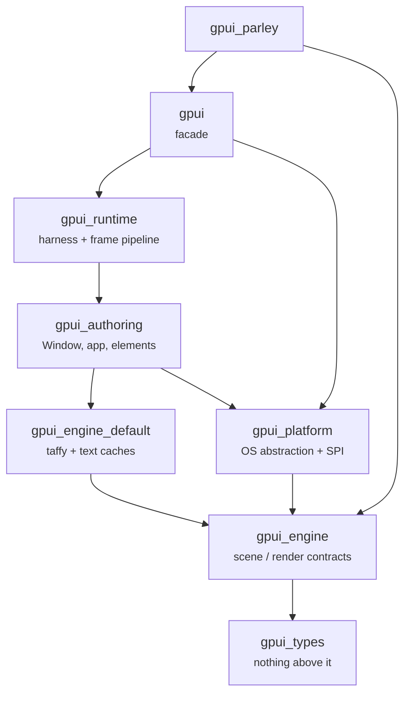

# The layer stack

How GPUI is re-cut into layer crates, and the rulings that decide where a new item
goes. This is the architecture of the *engine*; the mechanics of building the stack
live in the tools repository.

Moved here on 2026-09-26 from `.tools/docs/architecture.md` §0, §1 and §3, which
described GPUI rather than the tooling that applies it — see [`README.md`](README.md).
Measurements below are as of `bite_v1.23.1-pre` (`e867ece9f9`).

## The aim, because it decides everything else

Turn a **fork** into a set of **installable crates** on top of an **unchanged upstream
public surface**.

That is why the stack is a *stack of commits* and not a vendored copy: a fork should be
able to depend on published `gpui_*` crates and keep compiling, and upstream should be
able to take any subset of the layers as submitted PRs. Every ruling in §3 follows from
that aim; when a new question comes up, ask which answer keeps the upstream surface
intact.

## The layers

Measured at `bite_v1.23.1-pre` (`e867ece9f9`), source files under `crates/*/src`:

| crate | files | bytes | role |
| --- | --- | --- | --- |
| `gpui_types` | 10 | 187 KB | colour, geometry, and the rest of the shared vocabulary. Depends on nothing |
| `gpui_engine` | 14 | 155 KB | the scene/render contracts: `Scene`, sprites, atlas, renderer SPIs, `LineLayout` as data |
| `gpui_engine_default` | 5 | 88 KB | the concrete implementations: Taffy layout, the text caches |
| `gpui_platform` | 30 | 187 KB | the OS abstraction and the platform SPI: `Platform`, `PlatformWindow`, executors, dispatch |
| `gpui_authoring` | 80 | 2.46 MB | `Window`, app, elements, the UI surface — the layer most callers actually use |
| `gpui_runtime` | 3 | 19 KB | the application harness and the frame pipeline |
| `gpui_parley` | 1 | 43 KB | a Parley-backed text system |
| `gpui` | 2 | 8 KB | the facade: re-exports and the platform entrypoints (the rest of the crate is examples and benches) |

Dependency edges as declared in the manifests — the direction that matters when
deciding where a new item goes:

Two edges are deliberate and worth knowing before "fixing" them:

- **`gpui_platform` depends on `gpui_engine`.** The platform SPI names scene
  vocabulary (`PlatformWindow` returns `Scene`, `PlatformAtlas` keys off `AtlasKey`).
  Upstream's crate had the platform crate *contain* that vocabulary; the stack moves
  it out and the leaf keeps naming it. This is the layer order most likely to be
  inverted by a fork that starts from the engine side — gpui-ce did, and the
  divergence is recorded in `.tools/docs/reference/divergence-ledger.md`.
- **`gpui_parley` depends on the `gpui` facade.** That is the point of a text system
  here: it is written against gpui's public surface and replaces `TextSystem` from
  *outside* GPUI, rather than GPUI reaching for it. The same shape is the goal for an
  out-of-tree scene renderer and for the pipeline/runtime experiments.

The support crates (`gpui_shared_string`, `gpui_util`, `gpui_macros`) sit under all of
this. The backends — `gpui_linux`, `gpui_macos`, `gpui_apple`, `gpui_windows`,
`gpui_wgpu`, `gpui_web` — implement the platform SPI and depend on `gpui_platform` and
`gpui_engine` (plus `gpui_wgpu` where they render through it; a `gpui` dev-dependency
for tests is not part of the layering).

## The rulings

Each of these was a decision taken once and applied everywhere after. They are here so
a new question can be answered by rule rather than by taste.

### Decorate traits; do not fork them

When a fork needs a method the reference trait does not have, add an extension trait
above the layer (`TextSystemEx`, `PlatformEx`, `KeybindingKeystrokeMapperExt`,
`PlatformDispatcherExt`, `ImageExt`, `LineLayoutExt`) instead of adding the method to
the trait. The moved type stays byte-identical to the reference and the fork keeps its
published surface. `LineLayoutExt` in the reference is the precedent.

The cost is honest and should be stated: each extension is an addition the reference
does not have, and the reference sometimes *deletes* what a fork extends. Each one is
an unforced, reversible trade, recorded per item in
`.tools/docs/reference/divergence-ledger.md`.

### A leaky abstraction gets an escape hatch, not a new method

`MacActivationPolicy` exists only on macOS. Adding it to `Platform` would have added a
method to every platform's impl to describe one platform's behaviour. The ruling: **do
not widen the shared trait** — put the capability on the concrete platform and reach it
by downcasting. Reserve trait widening for a concept that genuinely generalises; where
an OS feature does generalise (a layer-shell on Wayland, `WS_EX_TOOLWINDOW` on Windows,
`_NET_WM_WINDOW_TYPE` on X11), the abstraction is worth elevating then, and not before.

### Fork additions live in fork-marked crates

Anything a fork adds to a shared ABI — a `Scene` field, a `ShaderBool` — goes in a
fork-marked crate (`gpui_ce_types`) or a fork crate (`gpui_ce_*`, `gpui_parley`), never
into a crate that upstream owns. Upstream's public surface stays unchanged; the fork's
additions are additive and identifiable.

### Commit to upstream, or carry it as a patch — decide once per change

The test, stated in `packaging/bundle_crate_assets.py`'s docstring, is whether the
change is about the *crate* or about the *monorepo*. Bundling an out-of-crate
`include_bytes!` asset into the crate is a source change that belongs on the branch that
publishes the crate, because after it the crate no longer depends on the monorepo's
layout. Anything of that shape is a commit, not a staging hack — staging should not be
papering over structure that the source should carry.

### The inspector token stays off the authoring surface — the one named exception

`Element`'s `request_layout`, `prepaint` and `paint` take no `inspector_id`. Upstream
threads `Option<&InspectorElementId>` through all three; the stack removes it, because
the runtime already derived the token itself — from the element's source location and the
id stack — so every implementor was only forwarding or ignoring it, and element authors
were being handed an internal type to think about. `Drawable` now publishes the identity
it computes on the `Window` for the duration of each lifecycle call and puts the previous
one back, so nested elements attribute correctly.

Taken in the `gpui_engine` boundary of the 111-commit patchset: `1b356da9ae` hid the
token from the docs and kept the parameter ("churning every in-tree `Element`
implementation to remove it would cost more than it is worth while the crate boundaries
are still moving"), then `a4af8bcd47` removed it as the follow-up, accepting that "sixty-one
implementations outside the runtime" lose a parameter per method (2026-09-14).

**This is the one ruling that trades against the aim, and it is named as an exception
because of it.** A public trait's method signature is part of the surface that anything
implementing it must match, so an implementor written against upstream does not compile
against the stack. Measured: 30 files take the parameter under `origin/main` and under
every base from `v1.14.x` to `v1.22.0-pre`, and one in the fork — the publication helper,
not an implementor. It is an exception, not a precedent: an *addition* to a trait gets an
`*Ext` by the ruling above, and a *removal* from one is only justified where the
parameter was never load-bearing.

Two things would retire it. The parameter is ceremony at 61 call sites, so keeping the
fork's shape is arguable on its own terms; and the precursor named a different end state —
folding inspector identification into `GlobalElementId`, which the element already
receives — which was never taken.

Note which way this diverges. It is the **reference patchset diverging from upstream**;
ce keeps upstream's shape and so diverges from the *reference* in the other direction. The
other comparison is recorded in `.tools/docs/reference/divergence-ledger.md`, whose remit
is ce against the reference rather than the reference against upstream.

`api_surface.py` reports this slice clean and cannot report otherwise: it keys on `pub fn`
and `pub struct|enum|trait`, so trait methods are outside its remit (the limitation
recorded in `.tools/docs/reference/ce-rewrites.md`). A trait-method change is checked by
the compiler — every implementor stops compiling, which is how this one surfaced — and by
a diff of the trait declaration.

The removal is proposed upstream as `gpui-drop-inspector-token` on `vanuan/zed`;
[`../issues/0004-inspector-token-upstream.md`](../issues/0004-inspector-token-upstream.md)
records the port and what would close it.

## The test the rulings exist to serve

A new use — the scroll demo, the `gpui_parley` text system, an out-of-tree scene
renderer, morphorm-for-taffy, a pipeline/runtime experiment, `gpui_mobile` — should
need only published crates and an extension trait, not a change to the stack. If it
needs a change to the stack, that is the signal to re-open the rulings rather than to
special-case it.

That test is what makes this document worth reading before adding anything: it is the
criterion by which `FramePipeline` was left an open seam rather than shipped with a
third swap ([`../decisions/0001-no-third-swap.md`](../decisions/0001-no-third-swap.md)),
and the criterion the render extension has to clear
([`../spi/rendering/renderer-seam.md`](../spi/rendering/renderer-seam.md)).
