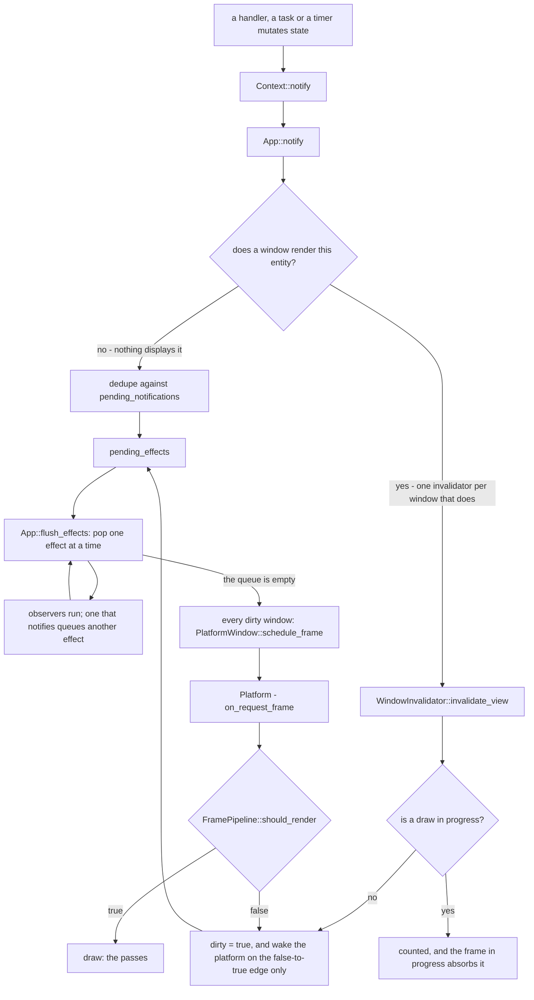
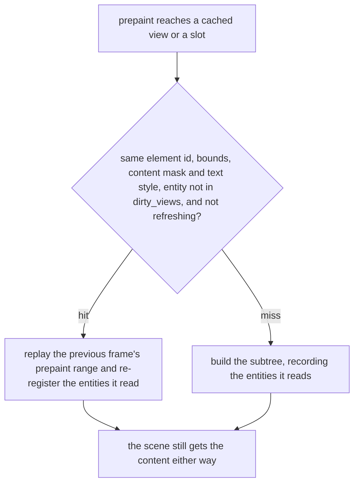

# The reactive layer

How a state change becomes a frame. This is the layer every other seam sits on, and
until this document existed it was one node in
[`frame-flow.md`](frame-flow.md) that nothing else described: entities, `notify`, the
effect queue that runs observers, and the invalidator that decides whether a window is
dirty and whether the platform should be woken.

Grounding: `crates/gpui_authoring/src/app.rs` (the effect queue, `notify`, the window
bookkeeping), `crates/gpui_authoring/src/app/context.rs` (`notify`, `emit`, `observe`,
`subscribe`) and `crates/gpui_authoring/src/window.rs` (`WindowInvalidator`).

## The chain

## The pieces

| what | where | what it is for |
| --- | --- | --- |
| `Effect` | `app.rs:3089` | the queue's item: `Notify`, `Emit`, `RefreshWindows`, `NotifyGlobalObservers`, `Defer`, `EntityCreated` |
| `pending_effects: VecDeque<Effect>` | `app.rs:654` | what the next flush will drain. Effects cause effects, so the queue is drained to quiescence |
| `pending_notifications: FxHashSet<EntityId>` | `app.rs:690` | dedupes a notify from an entity nothing is displaying |
| `observers: SubscriberSet<EntityId, Handler>` | `app.rs:656` | who to run when an entity notifies |
| `tracked_entities: FxHashMap<WindowId, FxHashSet<EntityId>>` | `app.rs:699` | the entities a window *actually renders right now*, rebuilt per frame by `record_entities_accessed` (`app.rs:1113`) |
| `window_invalidators_by_entity` | `app.rs:697` | an entity's invalidator per window. **Monotonic** — an entry alone does not mean the window still displays the entity, which is why the lookup is filtered |
| `WindowInvalidator` | `window.rs:175` | per window: `dirty`, `dirty_views`, `update_count`, the platform waker |
| `update_count` | `window.rs:273` | how many invalidations this window has seen. Read by `Window::dispatch_event` to ask whether an input event *caused* one (`window.rs:6174`), which is what feeds the input-rate tracker |
| `dirty_views` | `window.rs:155` | the views invalidated since the last draw. `finish_frame` clears it (`window.rs:3663`) |

## The chain, step by step

1. **`Context::notify`** (`context.rs:221`) forwards to **`App::notify`** (`app.rs:2791`)
   with the entity's id. `notify` is the only thing that means "this entity changed";
   there is no diffing anywhere.
2. **`App::notify` fans out to windows, not to the world.** It looks up the entity's
   invalidators, then filters them through `tracked_entities` (`app.rs:2798-2810`) with
   the comment that the map is monotonic and an entry alone does not mean the window is
   rendering the entity. So a change reaches only the windows that display it.
3. **With no window displaying it**, the notify is deduped against
   `pending_notifications` and queued as `Effect::Notify` — observers still run.
4. **With a window displaying it**, `WindowInvalidator::invalidate_view` (`window.rs:196`)
   runs per window: `update_count += 1`, the view goes into `dirty_views`, and then it
   branches on `draw_phase`.
5. **Outside a draw**, the window is marked dirty, the platform waker fires **only on
   the false-to-true edge** (`became_dirty`), and a `Notify` effect is queued so
   observers run.
6. **Inside a draw** (`DrawPhase::Prepaint`/`Paint`/`Focus`), none of that happens: the
   invalidation is counted and recorded and the function returns `false`. The frame in
   progress absorbs it — `mark_view_dirty` (`window.rs:2385`) puts the view and its
   ancestors into the frame's `dirty_views`, which is what keeps a cached view from
   being reused after something under it changed (`view.rs:442`).
7. **`flush_effects`** (`app.rs:1725`) drains the queue one effect at a time. A `Notify`
   runs the emitter's observers (`app.rs:1817`); an observer that notifies queues another
   effect, which is why the loop exists and why it terminates only at quiescence.
   `RefreshWindows` marks every window dirty (`app.rs:1837`).
8. **When the queue is empty**, every window that is dirty, needs a present, or has
   next-frame callbacks calls `PlatformWindow::schedule_frame` (`app.rs:1750-1765`).
9. **The platform delivers a frame request**, the frame source throttles, and
   `should_render` is asked — [`frame-flow.md`](frame-flow.md) takes it from there.

## Three properties worth knowing

**A deferred frame still gets asked for again.** The comment on that tail is explicit:
*"A dirty window asks for a frame even when the pipeline defers drawing it: deferring is
a decision about the frame's work, not about whether the platform should wake us to
decide again."* This is the mechanism that makes `should_render`'s `false` a *deferral*
rather than a drop, and it is why a pacing policy cannot stall a window by answering
`false` forever.

**A burst does not become a burst of wakes.** The platform is woken on the false-to-true
edge of `dirty`, not once per invalidation, and `dirty_views` is a set. State is
coalesced; what is *not* coalesced on the with-invalidator path is the observer effect,
which is queued per `notify` call. Ten notifies from one entity in one flush are ten
observer runs and one dirty window.

**Invalidations made during a draw are absorbed, not dropped.** They are counted in
`update_count`, recorded in the frame's `dirty_views`, and used to defeat the view
cache — but they do not re-dirty the window or wake the platform, because the frame
already in flight is the thing that will act on them.

## The other half: what is *not* rebuilt

The chain above explains when a frame happens. It does not explain why a frame is
cheap: a dirty window still replays almost all of its subtrees. That is the
fine-grained half of the layer, and it is a separate mechanism — entity-granular cache
invalidation, not whole-window re-rendering.

### Reuse is opt-in, through an extension trait

| API | for |
| --- | --- |
| `entity.cached(style)`, `any_view.cached(style)` (`view.rs:242`, `view.rs:43`) | a type that implements `Render` |
| `entity.slot(id, builder)` — `EntitySlotExt` (`crates/gpui_authoring/src/elements/slot.rs:16`) | state with no renderer of its own, or rendered differently in different places |

Both funnel into `prepaint_cached_view` (`view.rs:426`). `EntitySlotExt` is an extension
trait rather than a method on `Entity`, which is the ruling in
[`layer-stack.md`](layer-stack.md): decorate the trait, do not widen it.

A plain `.child(entity)` is the **uncached** path — the subtree is rebuilt every frame.
Reuse is something a view asks for.

### The decision the cache makes

On a hit the builder is never called: `reuse_prepaint` (`window.rs:4294`) replays the
previous frame's prepaint range, and `extend_accessed` (`entity_map.rs:180`) re-registers
the entities the cached subtree had read, so what the window depends on stays accurate
without re-running anything.

### The contract that comes with it

**A cached subtree is laid out from its own style, and is never measured from its
contents.** Measuring would mean building it, which is the thing being avoided. So a
slot has to be given a definite size — `.size_full()`, or an explicit one — and a view
that only works out its size from what it contains cannot be cached. This is stated on
both APIs and is the trap in the mechanism.

### `refresh` is the coarse escape hatch

`refreshing` is part of the cache-hit test, so a window refresh rebuilds everything.
`App::refresh_windows` queues it (`app.rs:1083`), `apply_refresh_effect` marks every
window dirty and sets the flag (`app.rs:1837`), and `ViewElement::cached`'s own doc says
`Window::refresh` *"ignores caching"*. When the cache is wrong, that is the way out —
and it is why the cache-hit condition has to name the flag.

### The two halves are one design

The entities a subtree reads are recorded when it is built (`detect_accessed_entities`,
`app.rs:1097`) and re-registered when it is replayed. That is what populates
`tracked_entities` — the map step 2 of the chain filters `App::notify` through. So an
entity is rebuilt because it notified, and it is notified only in the windows whose
cached subtrees actually read it. The cache and the fan-out are the same mechanism seen
from its two ends.

One exception worth knowing: when the inspector is picking, a slot builds its subtree
even on a cache hit (`crates/gpui_authoring/src/elements/slot.rs:128`), because the inspector picks through a tree it can
see and a replayed subtree is not a tree it can see.

## What this means for the seams

- **`is_dirty` is born here and is a boolean, not a count.** A `FramePipeline` is told
  *that* something changed, never how much. A policy that wants a rate has to measure
  time itself, which is what every implementation in this project does.
- **The observable burst is already coalesced.** A pipeline cannot see a burst of
  invalidations as a burst; by the time it is asked, the effect queue has run to
  quiescence and the window is simply dirty. This is why gating a "notify storm" at the
  pipeline seam was never going to work — see
  [`../spi/input/input-policy-seam.md`](../spi/input/input-policy-seam.md).
- **The window's rate is decided in three places, in this order.** This layer decides
  when a frame is *asked for* (step 8), the frame source decides whether to *serve* the
  ask (the thermal and inactive throttle), and only then does `FramePipeline` decide
  whether the frame *does its work*. Anything measuring a frame rate has to say which
  of the three it is measuring.
