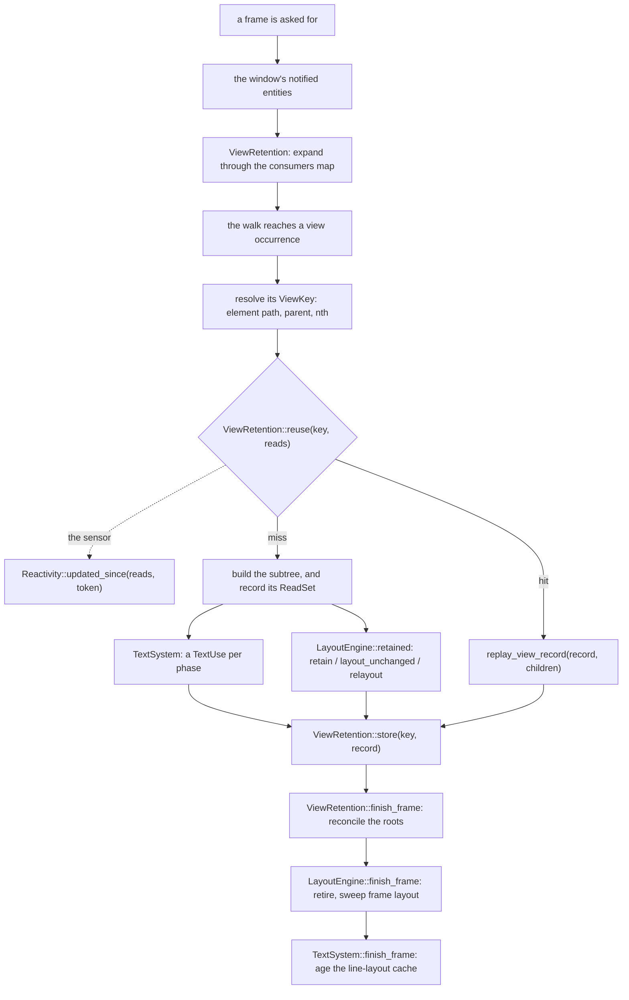

# Retention seams, and what blocks them

- **Status: proposed.** Nothing here is implemented, and everything from §5 on is a design, not
  code. This is the *seam* companion to [`view-retention.md`](view-retention.md): that chapter is
  what the two designs do; this one is how retention would attach to *this* stack, and what stops
  each attachment point.
- **Sources.** The same two efforts, read at the same places: Zed `#63800` at
  `refs/pull/63800/head` (`3d0b7f0a`) and gpui-fast's `main` (`fast/`, `docs/`). Claims about this
  stack are cited against `bite_v1.22.0-pre`. `bite-gp-morphorm` and `bite-gp-parley` are named but
  not cited by line: they are published from repositories of their own, not from this checkout.

## 1. The seams that exist

| seam | where | what it carries | a second implementation |
| --- | --- | --- | --- |
| `LayoutEngine` | `crates/gpui_engine/src/layout.rs:53` | `clear()` per frame; `request_layout(style, rem_size, scale_factor, children) -> LayoutId` — **no identity** | `bite-gp-morphorm`; Taffy at `crates/gpui_engine_default/src/layout.rs:375` |
| `FrameSession` | `crates/gpui_engine/src/frame_session.rs:18` | owns the layout engine for a window; the scene stays in the facade's frame | — |
| `FramePipeline` | `crates/gpui_authoring/src/window/frame_pipeline.rs:28` | passes over `PreparedRoots`; `should_render` defers a frame | `bite-gp-pass` |
| `TextSystem` | `crates/gpui_engine/src/text_system.rs:33` | already carries layouts across frames — `layout_index` at `:133`, `reuse_layouts`, `truncate_layouts` | `bite-gp-parley` |
| `.cached()`, and **not a seam** | `view.rs:295` (`ViewElementState`), `view.rs:302` (`ViewElementCacheKey`), `view.rs:426` (`prepaint_cached_view`) | one view's previous prepaint/paint ranges, replayed by `window.rs:4244` / `window.rs:4317` against `window.rs:1021` / `window.rs:1031` | — |

## 2. Why it is not a plugin today

Four findings, each the reason for one:

1. **The reuse unit is the view boundary, inside the walk.** A view is an `Element`
   (`crates/gpui_authoring/src/element.rs:55`) driven by `Drawable` during `layout_roots` /
   `paint_roots`. Retention must decide *per occurrence, mid-walk*; there is no trait at that point.
2. **`LayoutEngine` carries no identity and is told to clear.** `request_layout` receives style and
   child `LayoutId`s; the contract is `clear()` "ready for a fresh frame". A retaining solver cannot
   match a node to an element, and would be cleared anyway.
3. **`FramePipeline` sees roots, not view occurrences.** It can *defer a whole frame*, which is
   pacing, not subtree reuse; one dirty row still rebuilds everything.
4. **The reuse state is `pub(crate)`.** The record/replay is index surgery over the frame's flat
   vectors, not a type anyone outside the crate can name.

## 3. What a re-cut of the crates would and would not buy

The question "can we move parts of `gpui_authoring` into `gpui_engine` / `gpui_runtime`" has a
clear answer, and it is *no*, along the axis that matters:

- The crate says it itself: *"The element DSL is not separable from the runtime: an element is laid
  out and painted with a concrete `Window` and `App`"* (`crates/gpui_authoring/src/gpui_authoring.rs:8`).
- `gpui_runtime` is **above** authoring — it installs `Application::with_layout_engine`
  (`crates/gpui_runtime/src/application.rs:92`) and `with_frame_pipeline` (`:107`) but reaches
  authoring only through its public surface. It can hold a *policy* or a decorator; it cannot own
  the frame state.
- `gpui_engine` is **below** `gpui_platform`, and the frame's channels name `PlatformInputHandler`
  and `PlatformWindow` — so the frame cannot move down without inverting that edge.
- The tier boundary already exists, *inside* the crate: `_authoring.rs:65` "What is not authoring
  API" (frame orchestration, element storage, frame double-buffering and the hit-test tree at `:75`)
  and `:82` "The rest of `Window` is runtime API".

The pivot is `Window`. Any cut that isolates the walk also moves `Window`, which either drags the
platform SPI into the engine or erases the engine/authoring distinction.

## 4. The traits a retention seam needs

Five, of which **three are axes** a mode chooses and **two are capabilities** it uses. The
signatures are in §5–§7, where [`view-retention.md`](view-retention.md) §5's combined design is
turned into a seam on *this* stack; the axes are:

| axis / capability | trait | layer | choices |
| --- | --- | --- | --- |
| axis | `ViewRetention` | authoring | `Immediate` · `PersistentTree` (A) · `SideTables` (B) |
| axis | `Reactivity` | authoring | `StrictNotify` (A) · `UpdateGenerations` (B) |
| axis | `RetainedLayout` | engine | `–` · `NodeOwned` (A) · `KeyedPathHash` (B) |
| capability | `TextSystem` scopes | engine | shared |
| capability | `Scene` replay + `ViewRecord` | engine + authoring | shared |

Two of the names the signatures trade in are the two the blockers in §9 resolve, so they are fixed
once here and used throughout:

- **`ViewKey`** — *which mount* of a view this is: the occurrence `(element path, parent node,
  nth)` of R4. It is **not** an `EntityId`: one `Entity<V>` in two places is two keys, which is the
  whole reason R4 exists.
- **`ReadSet`** — everything a view's build depended on, in the three classes A insists are the
  only three: the entities, globals and state versions it read; the ambient inputs it read (R3);
  and the window values the cache key compares (bounds, content mask, text style, rem size, scale,
  opacity), plus the change tokens a build captures so the sensor can ask whether any of it has
  moved (§7). It is B's `RenderDependencies` under a neutral name, and it is what
  `ViewRetention::reuse` is handed and what the store re-registers on a replay — the per-view form
  of the window's `tracked_entities` in
  [`reactive-layer.md`](reactive-layer.md) §"The other half: what is *not* rebuilt".

The four modes are corners of that space; §10 is the matrix. The point of the factoring is its last
row: **AB is A's spine with B's sensor**, so it is a recomposition rather than a third engine. §7
shows where each axis is consulted, in one frame.

## 5. R0 — the recorder (resolved)

**The blocker.** An out-of-tree `ViewRetention` needs to record and replay a view's slice of the
frame. That slice is not a handle; it is a protocol across eleven channels in
`crates/gpui_authoring/src/window.rs:995` (`Frame`): hitboxes, tooltips (`:976`), deferred draws
(`:981`, holding a frame-arena `AnyElement`), the dispatch tree, accessed element states, mouse
listeners (type-erased closures), input handlers (the platform SPI), cursor styles, tab stops and
the text-cache index — addressed by `PrepaintStateIndex` (`:1021`) and `PaintIndex` (`:1031`) and
replayed by `reuse_prepaint` (`:4244`) / `reuse_paint` (`:4317`), which **move** slices out of the
rendered frame into the next and remap dispatch ids.

**Why publishing it is wrong.** The channels are heterogeneous in kind (plain data, non-cloneable
`dyn` closures, the platform SPI, frame-arena objects); the transfer is move-based and
order-sensitive; a record's lifetime is one frame pair, which nothing can enforce; two fields are
feature-gated; and the whole thing would freeze `Frame` — the crate's most-churned structure — as a
permanent public contract. It is the addition the rulings exist to prevent ("decorate traits; do not
fork them"; a leaky abstraction gets an escape hatch, not a new method).

**Resolution.** Publish the *opaque record*, not the slice. Authoring owns capture, splice and
replay; the trait owns only the store and the decision:

```rust
/// Opaque: authoring captures, splices and replays it.
pub struct ViewRecord(/* the private ranges + the closures/handlers moved out of the frame */);

pub trait ViewRetention: 'static {
    fn begin_frame(&mut self, window: &mut Window<'_>, cx: &mut App);
    /// May this view be replayed? `reads` is what it read when last built; the impl owns the
    /// answer (a dirty set, a consumers map, generations…) and the record it kept, if any.
    fn reuse(&mut self, key: ViewKey, reads: &ReadSet,
             window: &Window<'_>, cx: &App) -> Option<ViewRecord>;
    fn store(&mut self, key: ViewKey, record: ViewRecord);
    fn finish_frame(&mut self, window: &mut Window<'_>, cx: &mut App);
}

impl Window<'_> {
    fn capture_view_record(&mut self, f: impl FnOnce(&mut Window)) -> ViewRecord;
    fn replay_view_record(&mut self, record: &ViewRecord,
                          children: impl Fn(ViewKey) -> Option<ViewRecord>);
}
```

This keeps the eleven channels private, makes the orchestrator *shape* selectable (the impl owns the
map from `ViewKey` to `ViewRecord`, so status quo stores nothing, A a tree, B side tables, AB a
tree), and keeps the dirty-child-in-a-clean-parent splice inside authoring, where B's `splice.rs`
case becomes the `children` callback rather than a public buffer operation.

## 6. R1 — the published contracts (resolved)

**The blocker.** `LayoutEngine` and `TextSystem` are published as the swap seams
(`crates/gpui_engine/src/layout.rs:53`, `crates/gpui_engine/src/text_system.rs:33`) with
implementations outside the tree, so widening them incompatibly breaks published crates — the
opposite of the project's aim.

**Resolution: capability methods, added the additive way.** Retained layout is a concept that
*generalises*, so per `layer-stack.md` it earns a place on the trait — but as a provided method, so
no implementor changes:

```rust
// gpui_engine
pub trait RetainedLayout {                 // new; morphorm and parley never name it
    fn retain(&mut self, root: LayoutId);
    fn retire(&mut self, root: LayoutId);
    /// Re-runs layout for an owned root — only when something under it changed.
    fn relayout(&mut self, root: LayoutId, available_space: Size<AvailableSpace>,
                scale_factor: f32, ctx: &mut dyn MeasureContext);
    fn layout_unchanged(&self, root: LayoutId) -> bool;
}

pub trait LayoutEngine {
    // …unchanged…
    /// This engine's retention capability. Default: none — an engine that lacks it still works.
    fn retained(&mut self) -> Option<&mut dyn RetainedLayout> { None }
}
```

`TextSystem` gets the same shape, defaulted *shims over the carry it already has* (`layout_index` at
`crates/gpui_engine/src/text_system.rs:133`):

```rust
fn begin_text_use(&self) {}
fn end_text_use(&self) -> TextUse;                       // whole-frame carry by default
fn seed_text_use(&self, use_: &TextUse) { /* reuse_layouts(use_.index()) */ }
```

**The key stays out of the shared trait.** A retained engine does not need one: the node owns the
`LayoutId` that `request_layout` (`crates/gpui_engine/src/layout.rs:58`) already returned, so
`retain`/`relayout`/`layout_unchanged` name a root the caller holds — which is exactly the
"elimination of synthetic keys" the combined design takes from A. B needs one, because it has no
node to hold the `LayoutId`: `fast/layout_key.rs` re-derives a `u64` from the element path for the
engine to find its own node. That is B's shape, so it does not belong on a shared trait — B is a
fork and changes its own copy of `LayoutEngine`, and a keyed shape shipped *here* would be an `*Ext`
beside the trait, by the same ruling as `TextSystemEx`. **So A and AB add no method that mirrors
`request_layout`** — only the lifecycle around the root it already returned.

**What each crate does.** `bite-gp-morphorm` and `bite-gp-parley` compile unchanged and simply
cannot *host* a retained mode; Taffy (`crates/gpui_engine_default/src/layout.rs:375`) implements
`RetainedLayout`; authoring asks `layout_engine.retained()` once per frame and a retained mode with
`None` **degrades** to "retain render/prepaint/paint, relayout every frame". Placement falls out —
`RetainedLayout` and `TextUse` in `gpui_engine`, which name no `EntityId`; `ViewRetention` and its
vocabulary in `gpui_authoring`, where `EntityId` and `Window` live. **No vocabulary hoist is
needed.**

## 7. The walk, and the three axes together

A trait list is not an architecture until it is clear *where* each trait is consulted. Two of the
three axes meet at a single point — the reuse decision at a view occurrence — and the two
capabilities are reached only when that decision is a miss. The sensor is also written to from
outside the frame, where the changes it watches for happen.



Read top to bottom, four things fall out.

1. **A view has two ways to be dirtied, and the sensor is the second.** A routes a `notify`
   through the window's invalidator and the `consumers` map; that is the leftmost branch and it
   is unchanged. B adds a way a `notify` cannot express: something the view read moved without
   one. So `reuse` asks two questions — the store's "has a notify, or an ancestor that must
   rebuild, reached this view", and the sensor's "has anything in this view's `ReadSet` moved
   since it captured it". `Reactivity` is the second question only.
2. **The store answers; the sensor only reports.** "May this be replayed" is decided in
   `ViewRetention::reuse` and nowhere else, which is what lets the four modes differ in the store
   while sharing the sensor, or the reverse. The sensor is written to from the update and notify
   paths — outside the frame — and read once per occurrence, inside it.
3. **A miss is the only path into layout and text.** `retain` / `layout_unchanged` / `relayout`
   and the `TextSystem` scopes are reached on the build path, never on a replay — which is why an
   engine whose `retained()` is `None` still retains render, prepaint and paint and merely
   relayouts each frame (§6). The two are **not sequential**, and the diagram draws them as
   siblings for that reason: they interleave *per element phase*. Layout retention closes the
   layout phase (A's `store_layout` / `retire_layout`), each of the three phases brackets its own
   `TextUse`, and the measure closures *inside* the layout phase shape text attributed to the node
   that requested the layout. Any linear ordering of the two is a fiction.
4. **A dirty child inside a clean parent is the `children` callback.** `replay_view_record`
   re-enters the walk through it, and that is where B's `fast/splice.rs` case lives — inside
   authoring, where the frame's own channels stay private (§5). No public buffer operation, and no
   second walking order to keep in step. The frame is *replayed*, not spliced: with a node's own
   identity and stable cursors there is no flat buffer to cut a hole in (`view-retention.md` §5.4),
   which is the one place this document's vocabulary has to be kept apart from B's.

**The three `finish_frame`s run in that order.** The store's reconciles the roots and *decides*
what to retire; the layout engine's drops that and sweeps the frame-layout class R6 defines; the
text system's ages the line-layout cache. Retiring before reconciling would drop a root a replay
still re-attaches; aging the text cache before the sweep would drop a measurement the retirement
is still reasoning about. A has the first two and not the third — its cache is one frame deep by
construction — so the ordering is the combined design's own, and it is the kind of thing an
implementation finds by asserting rather than by reading: the oracle compares the whole frame, not
one phase of it.

### `Reactivity`, the axis with no precedent

A and B each implement this axis as *behaviour* rather than behind a trait: A deleted its entity
revisions and its `dependency_revisions`, and B keeps a per-entity stamp (`fast/dependencies.rs`,
its `EntityAccessLog::updated_at`). So the signature below is this document's proposal — a
transcription of B's mechanism behind a trait, so that `StrictNotify` can be the same trait doing
nothing.

```rust
// gpui_authoring
pub trait Reactivity: 'static {
    /// An `entity.update(..)` when no build is open. `StrictNotify` drops it — A's decision that
    /// the rule "cannot tell a read-only `update` from a mutation". `UpdateGenerations` stamps
    /// the entity, because a view may change a model it renders and notify only itself.
    fn note_update(&mut self, entity: EntityId);
    /// A `notify` that lands *while a build is open*. Stamped too: nothing else says whether it
    /// changed what the model holds. One outside a build that follows an update was counted by
    /// the update, and one alone changes nothing a view could have read.
    fn note_notify(&mut self, entity: EntityId);
    /// The freshness token a build captures, and the test against it later. Per read set, not per
    /// frame — which is why `UpdateGenerations` keeps a per-entity stamp at all, and why A, having
    /// deleted its revisions, has no equivalent.
    fn stamp(&self) -> u64;
    fn updated_since(&self, reads: &ReadSet, token: u64) -> bool;
}
```

Three things about where that leaves the rest. **The token is per read set, not per frame**, and
that is the part worth not simplifying away: "has anything I read moved since I was built" is a
question only a token captured at build time can answer. **Ambient inputs and state versions are
not here.** Focus, hover, viewport size and the `ListState`/`ScrollHandle` versions are the *store's*
business, because each is a read a view records in its `ReadSet` and each expands
dirty-then-ancestors through the machinery `consumers` already uses — a second index keyed by input
rather than entity, not a third axis. **And `StrictNotify` is two empty bodies, a constant token and
a `false`**, so the axis can cost nothing — which is what makes AB a recomposition of A's spine
rather than a different engine.

## 8. Finer than the view: two ways, and why neither is the mechanism

Both alternatives below come from the same instinct: retention's reuse unit is the **view** — and,
inside it, the slot — and each wants a smaller one. The first reconciles *output* (compare the element
tree with the last one and patch the difference). The second reconciles *input* (track dependencies
per property rather than per view). The second is the better idea, and its problem is the more
interesting one.

### Diffing element trees is not the mechanism

The next idea a reader reaches for is to give each view a `VNode` tree, keep the previous one, and on
a miss diff old against new to emit minimal layout, text and primitive patches — virtual-DOM
diffing, scoped to the miss branch. It is recorded here as **not taken**, because the reasons against
it are structural rather than a matter of taste, and it is the alternative that will otherwise be
re-proposed.

1. **There is no old tree to diff.** A node retains its *output record*, its Taffy root and its cache
   key; it does not retain its elements. An element is `AnyElement(ArenaBox<dyn ElementObject>)`
   (`element.rs:601`) — a type-erased arena object, neither `Clone` nor `PartialEq`, dropped with the
   frame. The tree is consumed by the walk precisely so that it need not be kept, and a retained
   element tree is the per-frame cost retention exists to avoid.
2. **GPUI's elements are not comparable data, and a diff is made of comparison.** The erasure above
   is what makes a props diff unworkable, and A says the same from the other side: `.cached()` is the
   one place props equality exists, it is opt-in, and its own note is that it requires `PartialEq`
   "since callbacks cannot be compared and a hand-written `PartialEq` has to choose to skip them".
   The tree being diffed would therefore have to be a *different* element representation — a new
   authoring model, against the aim of an unchanged upstream surface.
3. **It is a third reconciliation mechanism over state this design already diffs, on inputs.**
   `reuse`/`reuse_layout` compares a `ReadSet` and a cache key; B's layout node compares a style,
   child and measurement fingerprint before writing Taffy at all; `.cached()` compares a value. All
   three compare *inputs*, which are small comparable values. A `VNode` diff compares *outputs*,
   which are the expensive thing to materialize — and on a miss, `render()` has already been run to
   produce them.
4. **A miss is already minimal, and the record's contents are deliberately opaque.** A rebuilt node
   re-attaches its clean children as `Child(node, phase)` items, so a miss does not tear primitives
   down and rebuild them from scratch. And R0 declined to publish the record's contents for the same
   reason a patch list fails here: the transfer is move-based and order-sensitive. Patches that
   borrow the record they are about to replace do not compile, which is that objection as a borrow
   error rather than as an argument.

What is right in that direction is already here, and it is the half worth keeping: **two levels of
identity**. A `ViewKey` is macro identity — which mount, so a whole sub-view can replay — and element
identity within a node is micro identity, `(node, Location::caller(), nth)`, overridden by an explicit
key. That split is R4, and it is what keeps a reordered list from churning element state; B's keyed
layout lookup for a `uniform_list` row without an `ElementId` is the same idea one level down. No tree
diff is needed to say it.

Two smaller corrections to that sketch, for the record: the sensor is **not** an O(1) early exit in
general — B's test is a single `u64` compare only in the nothing-was-updated case, and scans the read
set otherwise — and its `ReadSet` is `{entities, globals}`, a strict subset of §4's, which would
reintroduce R3's untracked ambient inputs.

### Tracking dependencies per property is the better idea

The proposal: partition a view's reads into **structural** (read in a control-flow position — an
`if`, a match arm, a list iteration) and **leaf** (read inside a styling, layout or text expression),
track the leaf ones against their own patch targets, and on a change patch the slot in place instead
of re-rendering the view. Its ordering claim is right, and worth stating on its own: **fine-grained
reactivity does remove the need for diffing**, because if you know what changed you do not have to
compare outputs to find out. Three things stop it being a mode of this design.

1. **The partition cannot be computed from a read.** A read is `entity.read(cx)`; whether its value
   lands in a control-flow position or in a `label`'s text is a property of *how the value is used*,
   several expressions later. "Read in a control-flow position" is not something the engine can
   observe — there is no `bind` or `Signal` in the stack to observe it with. There are three ways
   out, and all three are already on this page: **annotate** it, which is a new authoring vocabulary
   and one no existing `render` uses; **diff** the outputs to see what moved, which is the
   alternative above; or **keep the view as the unit**. That is the whole objection.
2. **It needs a third protocol on the seam, naming the internals R0 refused to publish.** Patching a
   text slot, a Taffy style and a primitive's colour means naming a *patch target* — a slot id, a
   `LayoutId`, a byte offset — which is the record's inside. It is *resolvable* the way R0 was, as an
   opaque slot token plus a `Window` helper with capture and application left in authoring, but it is
   a third protocol where the design has two, and it is the one that makes the store name frame
   internals.
3. **It is not a corner of the matrix.** Status quo, A, B and AB share one contract: an entity
   notifies, the view re-renders, retention decides whether that was necessary. Fine-grained
   reactivity changes *when `render()` runs* — once for the leaf half, per notify for the structural
   half — so it is not a fifth row but a different table, and §4's axes describe how a *view* is
   retained.

Three specifics in that sketch are worth correcting rather than arguing about:

- **A property patch does not retain sibling geometry.** Taffy's dirty marking recomputes from the
  dirty node down, so any property that affects layout — `width`, `padding` — moves siblings and
  possibly the parent. Only a *paint-only* change (colour, border radius, opacity, text colour) leaves
  geometry alone, and that subset needs no layout at all. A already has the honest form of the
  layout-affecting case: `changed_bounds`, and the plan item to record positions relative to the node
  origin so a clean subtree that *moved* is translated on replay instead of rebuilt.
- **Text is cached per line, not per run.** The carry is `layout_index` / `reuse_layouts` /
  `truncate_layouts` over a `LineLayoutIndex` (`crates/gpui_engine/src/text_system.rs:133`), and a
  redraw seeds `(Arc<CacheKey>, Arc<LineLayout>)` pairs one per line. A changed label reshapes the
  *line* it is on and skips the lines whose key did not change — not "the shaped glyph run associated
  with the slot".
- **There are no stable byte offsets in the primitive stream.** The frame is the scene cache: a
  replay copies each primitive out of the rendered frame at its recorded lane cursor and paints it
  into the next. The bytes move every frame, and the record holds *kinds*, not primitives, so a colour
  patch would have to be consulted at paint time.

**What is worth keeping, and is not in the design.** A *value* slot is strictly easier than the
subtree slot the stack already has. `slot`'s contract is that it must be given a definite size,
because measuring would mean building it
([`reactive-layer.md`](reactive-layer.md) §"The contract that comes with it"); a slot whose builder
returns a `T` — a colour, a string — has no such problem, and re-running it costs one closure call
rather than a subtree. That is the smallest useful piece of this direction, and it still needs the
read re-parented from the view's `ReadSet` onto the slot, which is the authoring-model change in
miniature.

## 9. Blockers resolved (as designed)

The open items divide into three classes: fatal semantic hazards, frame-isolation invariants, and
the deployment trade-offs. Each resolution below is a design, not code — and where one is taken
from A or B rather than invented, it says so. Most of them are A's own remaining work, listed in
its plan, which is why they read as workable rather than hypothetical.

```
                          ┌── Class 1: semantic hazards (R11, R3, R5)
                          │     invalidation correctness, across the application
                          │
   R2–R13 taxonomy ───────┼── Class 2: frame-isolation invariants (R4, R6, R7, R8, R9, R10)
                          │     replay validity, across the Frame's own channels
                          │
                          └── Class 3: trade-offs and bootstrap (R2, R12, R13)
                                the engine tax, the fallback boundaries, the per-window factory
```

### Class 1: the semantic hazards

**R11 — the `notify` contract, and the one divergence to take.** In an immediate runtime a missing
`cx.notify()` is masked: an unrelated sibling, a reflow or a parent refresh rebuilds the subtree
anyway. Retain every view and the same omission leaves that subtree serving its last frame — a
stale region, not a permanent freeze, since any full refresh clears it, but stale until then. A
and B split here, and it is the one place they truly do. A makes it a decision: *"The engine does
not compensate for missing notifications (no revision counters, no 'any `update` is a change'
rule), because that rule cannot tell a read-only `update` from a mutation"* — missing
notifications are bugs, found with the oracle. B takes the opposite reading: an
`entity.update(..)` outside a draw counts as changed *even if nobody notified it*, because
upstream would have re-rendered the reading view anyway — and it has a second half that is easy to
miss: a `notify` that lands *while a subtree is being built* counts as an update too, because a
view mutating a model it read as it renders notifies only itself; a `notify` outside a build that
follows an update was already counted by the update, and one alone *"changes nothing a view could
have read"*. **AB takes B's sensor deliberately.**
The cost is re-rendering on a read-only `update`; what it buys is bug-compatibility with view
code written against upstream. It is a trade, not a free guarantee — B's rule still cannot see a
mutation made through shared interior mutability, or through a channel that is neither `notify`
nor an observed `update`, and B documents that residue: anything outside entities, globals and
list or scroll state *"has to be notified of"*.

**R3 — the ambient inputs.** Focus, window activation, viewport size, mouse position and hover are
read imperatively while an element builds, so they are in no read set, and A measures the stopgap:
*"A focus change, hover change or resize still calls `window.refresh()` today, so those frames
rebuild everything; they cost what every frame cost before the engine."* It is the largest source
of full rebuilds, and the coarse fix is wrong — one window-wide generation would make every focus
or resize a full-window rebuild, a refresh wearing a generation. **Resolution (A's own sketch, and
its list):** an `AmbientInput` read set per node — `Focus`, `WindowActive`, `ViewportSize`,
`MousePosition`, `Hover(HitboxId)` — recorded through a `Cell`, since the readers take `&Window`,
and expanded dirty-then-ancestors exactly as an entity read is. Hover needs two mechanisms
because a mouse move is not the only way the set changes: a **mouse move** diffs the hovered
hitbox set against the previous frame (hitbox ids are stable across a replayed frame) and dirties
only the readers of hitboxes that entered or left it — which is what retires the `refresh()` in
`div`'s hover listeners; a **relayout under a still mouse** moves what is under the cursor, so the
post-prepaint hit test runs the same diff and schedules a frame. A modality flip dirties every
hover reader. Without the second mechanism hover tears exactly where a clean parent shifts a child
under a stationary pointer. A third bucket catches the rest — bounds, content mask, text style,
rem size, scale, opacity, image cache — and is compared before reuse (A's `ViewNodeCacheKey`;
this stack's is `ViewElementCacheKey`, `view.rs:302`).

**R5 — frame-arena handles and carried measurement.** `BoxedMeasureFn` is `'static`
(`crates/gpui_engine/src/layout.rs:45`), so a measure closure cannot hold a borrowed arena
reference and a dangling pointer is not the hazard. The hazard runs the other way: the per-draw
arena is cleared by flipping a validity flag, so a closure kept across a frame and reading
arena-backed data sees invalidated memory, not freed memory. **Resolution — both halves, and they
complement each other.** Carry the *result*, not the closure: B states the rule for a measured node
— *"when last frame's text element at the same place measured the same text, runs and text style,
the new element takes a copy of that measurement and the node is left clean"*, because a measured
node *"given a new closure would be dirtied every frame, with every node above it"*. A adds the
classification for a closure that cannot be detached: a **frame-bound** node (`frame_bound_nodes`)
is excluded from `reuse_layout`, never carried past its frame, and rebuilt next frame — which is
how A first handled deferred draws before it made them roots. A carried measurement is therefore
always a value.

### Class 2: the frame-isolation invariants

Each is a channel of the frame, and each resolution is cited to the mode that has it.

| # | invariant | failure mode | resolution (as designed) |
| --- | --- | --- | --- |
| **R4** | occurrence identity | two mounts of one `Entity<V>` take the same element path — `ViewElement::id()` is `self.entity_id.map(ElementId::View)` (`view.rs:313`) — so they share one `(GlobalElementId, TypeId)` entry in the `Frame`'s single element-state map (`window.rs:998`) and cannot keep separate state or subscriptions | split **mount identity** from **state identity**: `View::element_id()` says where a node mounts and `View::entity()` which entity backs it; the mount is found again by the occurrence `(element path, parent node, nth)`, identity within a node being `(node, Location::caller(), nth)` overridden by an explicit key. A repeated mount of one entity goes to the next occurrence, and element state is per node |
| **R6** | orphan layout roots | a subtree laid out as its own root inside a node (`layout_as_root`, `element.rs:246` — list rows, editor blocks, the measured row of a `uniform_list`) hangs off no child list the node retains, so retiring the node's root never reaches it and it leaks one Taffy tree per item per frame | A found this by review and fixes it at layout time rather than by a list to retire: `Window::compute_layout` marks such orphan roots as **frame layout**, and `TaffyLayoutEngine::finish_frame` removes them as subtrees, stopping short of another node's retained root and never touching a tree a node painted with (`layout_trees_measured_inside_a_node_do_not_accumulate`) |
| **R7** | dispatch identity and deferred context | the dispatch tree's ids are per-frame. Upstream remaps a replayed subtree by an offset delta, which A documents as insufficient once empty nodes are elided and a child owns a nested range. And a `DeferredDraw` (`window.rs:981`) can only render in the ambient context it was attached in | A records a node's pushes and pops as a contiguous range of the live `dispatch_tree.nodes`, snapshots the non-empty nodes after paint, and resolves each parent to a kept node of the scope (`DispatchParent::Recorded`) or the scope's attachment point (`DispatchParent::Attachment`); reuse pushes them back under the active node. A **node-owned dispatch tree with stable ids** removes the snapshot altogether and is A's own follow-up — cleaner, but *"not needed for correctness or the measured performance"*. The deferred root must *capture the ambient context it was attached in* — element-id stack, text-style stack, rem size, content mask, offset and dispatch parent — and re-render there |
| **R8** | text-cache ownership | carrying text per view needs the cache to keep, per node, the `(key, layout)` pairs it looked up, not the whole-frame carry the trait's default shim gives (`crates/gpui_engine/src/text_system.rs:133`) | A makes the node the unit: each phase of a node holds its `TextUse` — including text shaped inside a Taffy measure closure, attributed to the node that requested the measured layout, since measuring runs outside the traversal — and a redraw seeds it back into the frame cache first; the cache stays one previous frame deep. The follow-up is to record the uses on the window's traversal stack as slices of one frame-level vector, so the `Arc` handles are moved rather than cloned and dropped per node |
| **R9** | input handler / IME on replay | `Frame::input_handlers` (`window.rs:1006`) holds the platform's `PlatformInputHandler`s; a replayed view whose subtree owned the focused handler would leave the platform pointing into a frame that is gone | resolve **dynamically**: A has the recordings own their handlers, leased out of their slot for the length of a call, and `PlatformInputHandler` *"resolves the rendered frame's input handler through its context on every call"*, so a replayed view moves nothing — it changes which handler the context resolves to |
| **R10** | atlas / tile lifetime | a replayed sprite can reference a tile the atlas released between frames — the crash behind Zed's atlas work | this one is **R1-shaped, not a pure invariant**: it needs an additive engine-SPI change, and there are two independent halves. Zed merged the renderer half — `#64623`, backends *skip a sprite whose texture was released instead of panicking* — while its `Window`-lifetime companion `#64619` was closed unmerged. A's branch does not ref-count tiles either: it forces a full refresh when an image is evicted, and lists *"audit for the same eviction pattern"* over GPUI's per-frame-use caches as remaining work. AB takes ref-marked tiles as a requirement on `PlatformAtlas` (`crates/gpui_engine/src/atlas.rs:56`) |

### Class 3: the trade-offs and the bootstrap

**R2 — the ship decision, and the shape of the hook.** This is the one still open, and it is the
user's call. A retention mode is not a *swap* in the sense of
[`decisions/0001-no-third-swap.md`](../decisions/0001-no-third-swap.md) — it is not a published
implementation of a published trait — but it is exactly the change `layer-stack.md`'s test says a
new use should not need, so adopting it *in* the stack re-opens 0001 while shipping it *out* of
tree (a `bite-gp-retained` the stack does not name, with the stack carrying only the seam and
`Immediate`) does not. Either way the hook follows the bootstrap seams already there:
`with_layout_engine` (`crates/gpui_runtime/src/application.rs:92`) and `with_frame_pipeline`
(`:107`) are factories, the first taking no window and the second a `WindowId`, and retention is
stateful per window — so it is the second shape, one instance per `WindowId`:

```rust
impl Application {
    pub fn with_view_retention(
        self,
        factory: impl Fn(WindowId) -> Box<dyn ViewRetention> + 'static,
    ) -> Self;
}
```

**R12 — the inspector and accessibility.** The interim is what the mechanisms already do: A's
`.cached()` bypasses itself while the inspector is picking (`is_inspector_picking`,
`window.rs:7493`), and B lists the same four things that are never drawn from the last frame — a
refresh, a drag, the inspector picking, accessibility active. **Resolution:** keep the fallback as
the interim — return `None` and rebuild in full while either is active — and take A's plan as the
target, since A names deleting both: stable per-mount ids with partial accessibility
`TreeUpdate`s, and inspector overrides modelled as reactive entities so an edit dirties exactly
one node.

**R13 — the tax, and where retention is allowed to sit.** A's cost model, measured on A's branch
and not this stack's: an all-dirty frame pays roughly `0.55 µs × dirty nodes + 0.08 µs × dirty
elements` — the per-node cost (occurrence lookup, cache key, three phases of begin/end, dependency
recording, the dispatch snapshot, layout retention) flat in node size, and the per-element cost
0.06–0.11 µs (a hitbox item, a primitive-kind byte, a text line's handle). It is paid on all-dirty
frames too, which is why the tax is invisible where nodes are many and trivial (`Siblings/all
dirty`) and only partly returned elsewhere. **Resolution — a boundary, not a universal:** pin
retention to `Entity<V: Render>`, the view boundary, so the per-node tax is paid once per view and
not per element, and the fine-grained leaves (`div`, text spans, `RenderOnce` closures) stay
transient. Memory follows the boundary: a trivial leaf node weighs about 2.5 KB, ~680 B of it the
`ViewNode` struct, and a 3-pane workspace holds about 20 nodes — tens of KB, not the megabytes a
per-element store would cost.

## 10. The resolution matrix

The four modes are corners of the axis space in §4, with the two Class 2 channels on which they
differ beyond the axes.

| mode | `ViewRetention` | `Reactivity` | `RetainedLayout` | dispatch (R7) | atlas (R10) |
| --- | --- | --- | --- | --- | --- |
| status quo | `Immediate` | – | – | frame-global ids, offset-remapped | unchanged |
| A — Zed view tree | `PersistentTree` | `StrictNotify` | `NodeOwned` | per-node ranges, snapshotted from the live tree | full refresh on eviction |
| B — gpui-fast | `SideTables` | `UpdateGenerations` | `KeyedPathHash` | spliced stretches in the frame's buffer | not addressed |
| AB — combined | `PersistentTree` | `UpdateGenerations` | `NodeOwned` | node-owned tree, stable ids | ref-marked tiles |

Two things the matrix is careful about. **The dispatch column is where AB goes past its sources**:
node-owned dispatch ids are A's own follow-up item, and A says they are *"not needed for
correctness or the measured performance"*; AB takes them because stable identity is what the
spine is for, not because either source needed them. **The atlas column is mostly negative**:
neither A nor B ref-counts tiles today — the merged Zed fix is the renderer skipping a released
texture, which hides the symptom rather than the lifetime — so AB is the first of the four to make
the atlas obey retention.

## 11. Where this leaves the thread

The recorder (R0) and the published contracts (R1) were the two that looked fatal and are not: one
resolves by publishing an opaque token instead of the frame slice, the other by adding
capabilities additively. The items that remained (R2–R13) are now resolved *as designs* rather
than listed as unknown, and the shape of the resolution is the point: every one is either a
per-input dependency (Class 1), an invariant about replaying a channel of the frame (Class 2), or
a deployment choice (Class 3). None is expressible at an existing seam, which is why they are
work to implement rather than a trait to publish.

What is *not* resolved is R2 — the ship decision, 0001's question aimed at a fourth candidate.
Until it is taken, [`issues/0005-view-retention.md`](../issues/0005-view-retention.md) still reads
as "adopt, defer, or reject", and the fork-in-step remains the option that needs none of this:
A's resolutions are work A has begun, and B ships without any of them.
