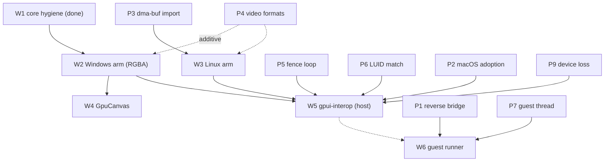

# The surface path: the plan, and the probes it gates on

- **Status:** proposed. The implementation plan for [`surfaces.md`](surfaces.md), and the
  measurements that must land *before* the code each stage needs. Nothing here is built except the
  pieces marked done.
- **Read with:** [`surfaces.md`](surfaces.md) (the design),
  [`milestones.md`](milestones.md) §4 (where this sits in the whole order), and the probes it
  extends: [`../../decisions/shared-surface.md`](../../decisions/shared-surface.md),
  [`../../decisions/windows-path-a-probe.md`](../../decisions/windows-path-a-probe.md),
  [`../../decisions/macos-wgpu-producer-probe.md`](../../decisions/macos-wgpu-producer-probe.md).
- **The convention a probe follows:** it is filed as *evidence* beside the decision it produced, and
  a probe still running lives with the work it gates
  ([`../../decisions/README.md`](../../decisions/README.md)).

## 1. The workstreams, in order

Each is independent of the ones below it unless the table says otherwise.

| # | workstream | crates / entry points | done when |
| --- | --- | --- | --- |
| **W1** | **Core hygiene — done.** `PixelBuffer`, and `render_scene` split from `read_pixels` | `crates/gpui_engine/src/renderer.rs:19`, `:102`, `:110` | upstream PR 1 lands; the rows in [`verification.md`](verification.md) §2 pass |
| **W2** | **Windows surface arm — RGBA/BGRA only.** Extend `SurfaceSource` with the DirectX variant and implement `draw_surfaces` | `crates/gpui_authoring/src/elements/surface.rs:13`; `crates/gpui_windows/src/directx_renderer.rs:852` (retarget `:862`) | an **RGBA/BGRA** SRV composites through `surface()` on `windows-latest`; upstream PR 2. YCbCr is deliberately out (P4) |
| **W3** | **Linux surface arm.** The `DmaBuf` variant and its import | `crates/gpui_authoring/src/elements/surface.rs:13`; `gpui_linux` + `gpui_wgpu` | a dma-buf composites on a Linux host with an adapter — gated on **P3** |
| **W4** | **`GpuCanvas`.** The authoring surface; Path A arm retargets onto `surface()` | `crates/gpui_authoring` beside `canvas` | the [hand-rolled demo](../authoring/gpu-canvas.md) becomes the element |
| **W5** | **`gpui-interop` — Host Mode.** Adapter matching, NT-handle export/import (D3D12/`wgpu` → D3D11), the fence bridge, and device-loss teardown | new downstream crate | the bridge composites with a producer on a second device, and survives the renderer losing its device — gated on **P2, P5, P6, P9** |
| **W6** | **Guest runner.** Headless GPUI on a worker thread | the offscreen contract + a runner | a foreign loop drives GPUI and samples the frame — gated on **P1, P7** |
| **W7** | **Path B — untouched.** | `crates/gpui_engine/src/custom_render.rs:41` (`Inline`) | no dependency on W2–W6; independent |

**W1 and W2 are the upstream pair**, and the reason the unification is worth the retarget: they are
PRs upstream will take, not a fork. W3–W6 are ours; W5 and W6 are one crate, planned in
[`interop-crate.md`](interop-crate.md).

Two things the first draft of this table got wrong, and the reasons. **P4 does not gate W2**: the
Windows PR ships as a plain RGBA/BGRA surface pass, and YCbCr/NV12 is an *additive* pass after it, so
a decoder's format can never stall an upstream merge. **P1 gates W6, not W5**: the reverse direction —
a Direct3D 11 producer *into* a `wgpu` consumer — is the brittle one, and Host Mode never needs it,
because a D3D11 producer uses the default `DirectXRenderer` and a `wgpu` producer uses `WgpuRenderer`.
If P1 fails, Host Mode is untouched.

## 2. The probes, before the code they gate

A probe answers one question; a test asserts a known answer. Each of these is a *question*, so each
is filed as evidence ([`../../decisions/shared-surface.md`](../../decisions/shared-surface.md) is the
shape).

**P1 — the reverse bridge direction (gates W6, the guest runner).** Both existing measurements
created the shared resource on the **D3D12** side and read it from D3D11 — the Host Mode direction.
The reverse, a *D3D11* producer into a `wgpu` consumer, is needed only when GPUI is hosted inside a
foreign `wgpu` loop (W6); its only first-party entry point is Vulkan's `texture_from_d3d11_shared_handle`,
gated `VULKAN_EXTERNAL_MEMORY_WIN32` ([`producer-reach.md`](producer-reach.md) §6). *Harness:* a
machine with a Vulkan driver (probe 6 had none). *Pass:* the handle is accepted and sampled. *Closes:*
whether W6 needs the Vulkan path at all — and **Host Mode is unaffected either way**, which is what
keeps this off W5's critical path. The full specification is
[`probe-p1-reverse-bridge.md`](probe-p1-reverse-bridge.md).

**P2 — macOS adoption of an `IOSurface` (gates the macOS half of W5).** The pool, the token and the
fence are measured; **adoption is not** — nothing yet builds an `MTLTexture` over an `IOSurface` with
`objc2-metal` and adopts it into `wgpu`
([`../../decisions/shared-surface.md`](../../decisions/shared-surface.md) §4). *Harness:* a Mac,
`texture_from_raw` over the hand-built `MTLTexture`. *Pass:* a wgpu render reads the surface bytes. The full specification is
[`probe-p2-macos-adoption.md`](probe-p2-macos-adoption.md).

**P3 — dma-buf import on Linux (gates W3).** Unmeasured on every axis: no Linux surface import has
been run at all. *Harness:* allocate a dma-buf, import it as a `VkImage`/`EGLImage` (external memory
fd / `EGL_LINUX_DMA_BUF_EXT`), sample it in the wgpu renderer. *Pass:* the imported buffer samples.
*Also answers:* whether `gpui_wgpu`'s instance enables the device extensions the import needs. The
full specification is [`probe-p3-dmabuf-import.md`](probe-p3-dmabuf-import.md).

**P4 — what a video surface actually is (shapes an additive pass; does *not* gate W2).** The
straight-through fragment assumes RGBA, and a VA-API/MF/NVDEC decoder emits NV12/YCbCr, often 10-bit —
but that is a *second* fragment, not a prerequisite for the RGBA surface pass. *Harness:* capture the
formats real decoders produce on each platform. *Pass:* a decision on whether YCbCr is a format arm or
out of scope. *Consequence:* it adds a pass; it never blocks W2.

**P5 — the fence bridge end to end (gates W5).** `ID3D12Fence` exported as a shared NT handle and
opened as an `ID3D11Fence`: `shared-surface.md` clears, polls and reads across the two devices but
carries **no fence between them**, and its fence probe orders two buffers on *one* device. *Harness:*
two devices, a full produce→signal→wait→consume loop. *Pass:* no tearing, no keyed-mutex stall. The
full specification is [`probe-p5-fence-loop.md`](probe-p5-fence-loop.md).

**P6 — adapter LUID matching (gates W5's adapter selection).** `wgpu` must select the *physical*
adapter GPUI's Direct3D 11 device is on. *Harness:* read both LUIDs and compare, per the hazard
[`windows-path-a-probe.md`](../../decisions/windows-path-a-probe.md) §5 names. *Pass:* a rule that
picks the same adapter, or a statement that it cannot be asserted and is therefore the application's.
**Run this early:** its answer is the crate's API — whether `attach` can find the adapter or the caller
must supply one ([`interop-crate.md`](interop-crate.md) §4) — so a late answer is a redesign. The full specification is
[`probe-p6-adapter-luid.md`](probe-p6-adapter-luid.md).

**P7 — guest thread viability (gates W6).** The renderer factory is `!Send` by construction (an
`Rc`), and the offscreen path must hand back a *shareable* surface, not only bytes. *Harness:* run
the offscreen contract on a worker thread and sample its surface from the host loop. *Pass:* the
executors tick and the frame is read.

**P8 — the two-GPU Mac (a corner of the macOS producer route).** The producer probe established a
wgpu adapter *is* the `MetalRenderer`'s `MTLDevice` under every power preference on a single-GPU Mac;
a two-GPU Mac is where the preference is the only lever and the finding could fail
([`../../decisions/macos-wgpu-producer-probe.md`](../../decisions/macos-wgpu-producer-probe.md)).

**P9 — device loss and re-negotiation (gates W5).** A Windows driver resets on sleep, a monitor
unplug, a DPI change or a GPU timeout (TDR); GPUI recreates its device, and every shared NT handle,
fence and texture view the producer holds becomes invalid. *Harness:* drop GPUI's device
(`PlatformRenderer::device_lost` → `recover`) while the producer holds a surface, then re-attach.
*Pass:* the bridge tears down and re-negotiates without crashing the host process. *This is a W5
acceptance case, not only a probe.* The full specification is
[`probe-p9-device-loss.md`](probe-p9-device-loss.md).

## 3. The order

**P3 is the cheap probe to run first** — it can change W3's shape before it is written. **P6 should
run early too**, because its answer *is* the crate's API ([`interop-crate.md`](interop-crate.md) §4).
P5 and P9 gate W5; P1 and P7 gate W6; and none of them is on the W2/W4 path, which is what keeps the
upstream PR unblocked.

## 4. Gates

- **W2 and W1 are CI-visible now.** The Windows arm's rows run on `windows-latest`; the engine's and
  authoring's rows run on Linux ([`verification.md`](verification.md) §3). The Linux *surface* arm
  (W3) needs an adapter and joins the local-only set, like the wgpu rows today.
- **The bridge (W5) is a probe, not a test.** It needs two devices and a second API; it is asserted
  where it can be and recorded where it cannot, per the probe convention.
- **`script/check-citations` is the standing gate** for this set: every new `path:line` resolves
  against the canonical ref, and the drift it prints is read, not trusted.

## 5. What would change the plan

- **P5 or P9 failing** turns W5 into "the same-device route only", and `0002`'s Tier 2 back into a
  deferral rather than a schedule. **P1 failing does not**: it only removes Guest Mode's reverse route,
  and Host Mode never needed it.
- **P4 finding only YCbCr in practice** does not touch W2's merge; it adds a format pass after it.
- **A `wgpu` release that creates shareable textures** collapses P2/P5 and most of W5 — the bridge
  becomes a wgpu argument instead of a handshake.
